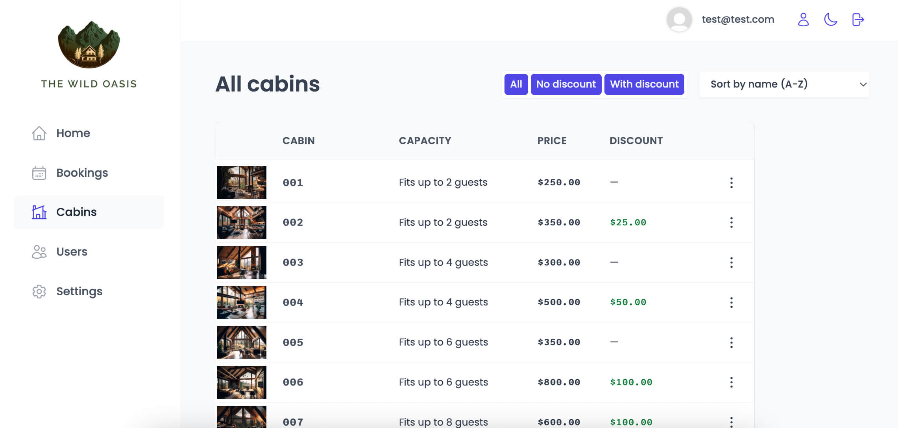
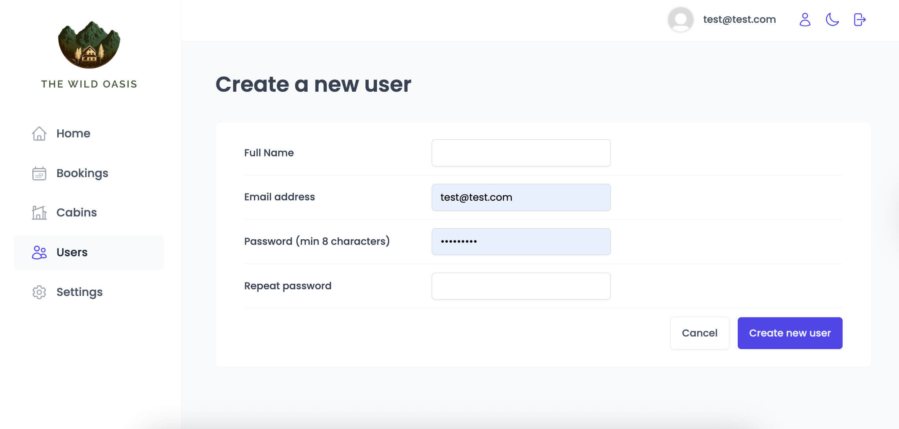
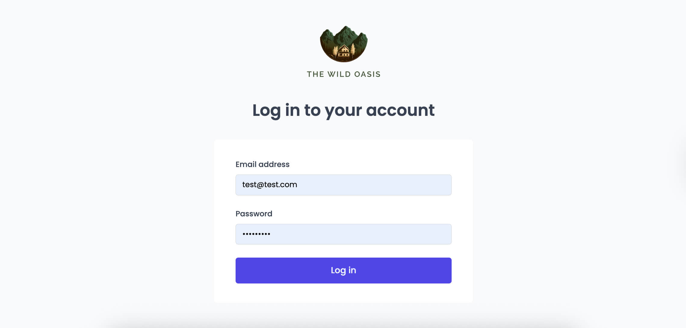
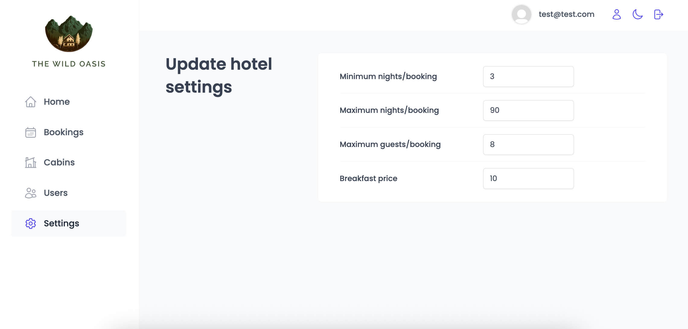
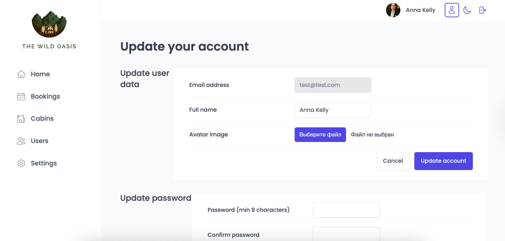

# The Wild Oasis Dashboard

Responsive property-management dashboard built hands-on while following Jonas Schmedtmann's The Wild Oasis module. Staff authenticate, monitor property performance, and run every booking workflow from one place.

-  Live demo: [https://the-wild-oasis-dashboard-panel.vercel.app/](https://the-wild-oasis-dashboard-panel.vercel.app/)

<p align="center">
  
  
  
  <br />
  
  
  
    <br />
  
</p>

## Features ⚙️

-  Supabase authentication with protected routes, persistent sessions, and a global dark-mode toggle so the dashboard always matches the user's preference.
-  Bookings workspace with advanced filtering/sorting, detailed booking view, and one-click flows to check guests in/out, add breakfast, or cancel reservations.
-  Cabin CRUD powered by React Hook Form: validate capacity/prices, upload images to Supabase Storage, and reuse the same form for create + edit inside modals.
-  Settings page that lets managers adjust nightly rates, minimum stays, and breakfast pricing—changes persist immediately to Supabase and invalidate cached queries.
-  Executive dashboard combining KPI tiles, sales charts, and stay-duration histograms (Recharts) that can switch between the last 7/30/90 days while React Query keeps data fresh.
-  Toast-driven UX for every mutation (react-hot-toast) so staff always see whether an action succeeded or failed.

## Tech Stack 🧩

-  React 19 + React Router 7 for route protection and nested layouts.
-  Styled-components (with CSS variables) for theming + responsive layout system.
-  @tanstack/react-query v5 for data fetching, caching, and mutation lifecycles.
-  Supabase (Auth, Postgres, Storage) as the backend-as-a-service.
-  React Hook Form for accessible forms and validation, date-fns utilities, Recharts visualizations, and React Hot Toast for notifications.

## What I Learned 📚

-  Coordinating Supabase queries, mutations, and cache invalidation through React Query instead of custom fetch logic.
-  Designing reusable table, modal, and form primitives with styled-components + compound components for consistent UX.
-  Coordinating check-in/out flows with React Query mutations while still treating Supabase as the single source of truth.
-  Managing file uploads (cabin photos) and complex validations inside React Hook Form without uncontrolled re-renders.

## Getting Started 🚀

### Prerequisites

-  Node.js 18+
-  npm
-  Supabase project with `cabins`, `bookings`, `guests`, and `settings` tables (matching the course schema)

### Installation

```bash
git clone https://github.com/ilona-web-dev/the-wild-oasis.git
cd the-wild-oasis
npm install
npm run dev
```

1. Duplicate `src/services/supabase.js` credentials with your own Supabase project URL and anon key (or refactor to read from environment variables before deploying).
2. Create a `.env` (optional) for keys like `VITE_SUPABASE_URL` and `VITE_SUPABASE_KEY`, then import them via `import.meta.env`.

### Available Scripts

-  `npm run dev` – start Vite dev server on `http://localhost:5173`.
-  `npm run build` – production build to `dist/`.
-  `npm run preview` – preview the production build locally.
-  `npm run lint` – run ESLint with the provided config.

## Project Structure 🗂️

```
src/
├─ context/           // app-wide providers (dark mode)
├─ data/              // mock/seed data helpers
├─ features/
│  ├─ authentication  // login form, auth hooks
│  ├─ bookings        // booking table, operations, detail views
│  ├─ cabins          // cabin CRUD forms + hooks
│  ├─ check-in-out    // check-in wizard & breakfast upsell
│  ├─ dashboard       // stats, charts, filters
│  └─ settings        // app configuration panel
├─ hooks/             // shared custom hooks (outside React Query)
├─ pages/             // route-level components
├─ services/          // Supabase client + API helpers
├─ styles/            // GlobalStyles + theme tokens
├─ ui/                // reusable layout + form primitives
└─ utils/             // formatting + helper functions
```

## Future ideas 🔜

-  Implement role-based access (admin vs. front-desk) for more granular permissions.
-  Add exports (CSV/PDF) for bookings and revenue reports.
-  Build a mobile-friendly layout so staff can manage stays on tablets/phones.
-  Introduce push/email notifications so guests and staff receive real-time updates on check-ins, cancellations, or maintenance alerts.
-  Allow front-desk staff to create bookings manually for walk-in guests so on-site inquiries can be recorded immediately without the public form.
